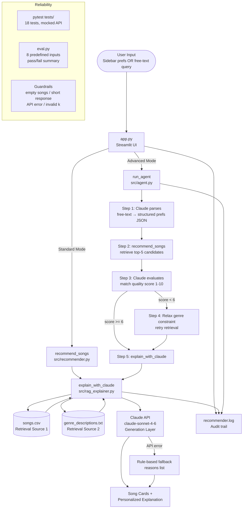

# System Architecture Diagram

This diagram reflects the actual upgraded implementation.

## Components

| Component | File | Role |
|---|---|---|
| Streamlit UI | `app.py` | Main entry point, Standard + Advanced modes |
| Recommender | `src/recommender.py` | Scoring engine (MAX_SCORE 6.80), data loading |
| RAG Explainer | `src/rag_explainer.py` | Multi-source retrieval + Claude generation |
| Agent | `src/agent.py` | 5-step agentic workflow with observable steps |
| Logger | `src/logger_config.py` | File + console logging |
| Song Catalog | `data/songs.csv` | 18-song retrieval source |
| Genre Knowledge | `data/genre_descriptions.txt` | Second retrieval source for Claude context |
| Test Suite | `tests/` | 18 tests, all API calls mocked |
| Eval Harness | `eval.py` | 8 test cases, no API key required |
